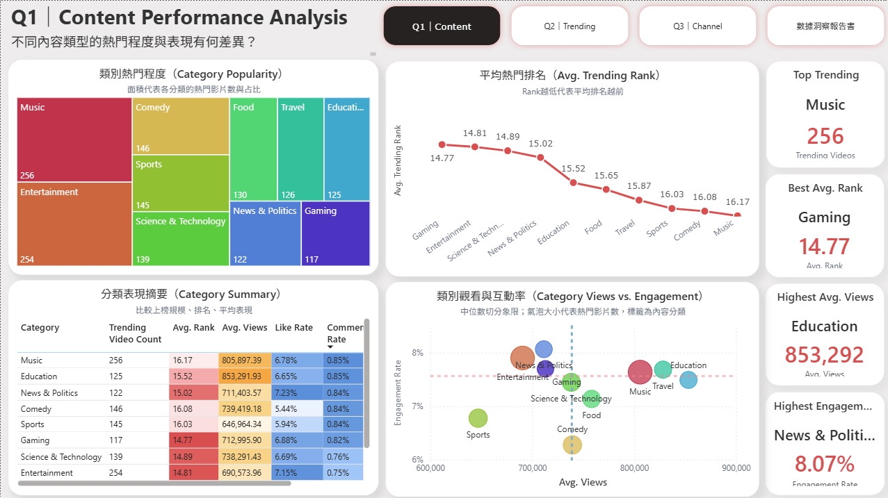
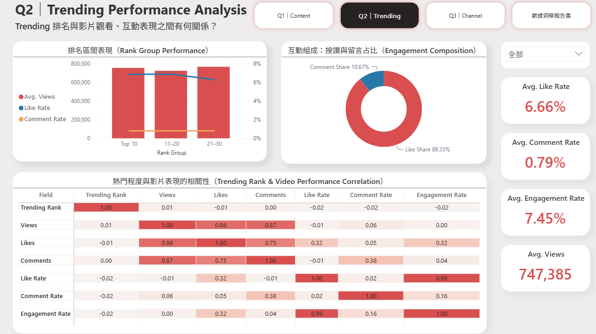
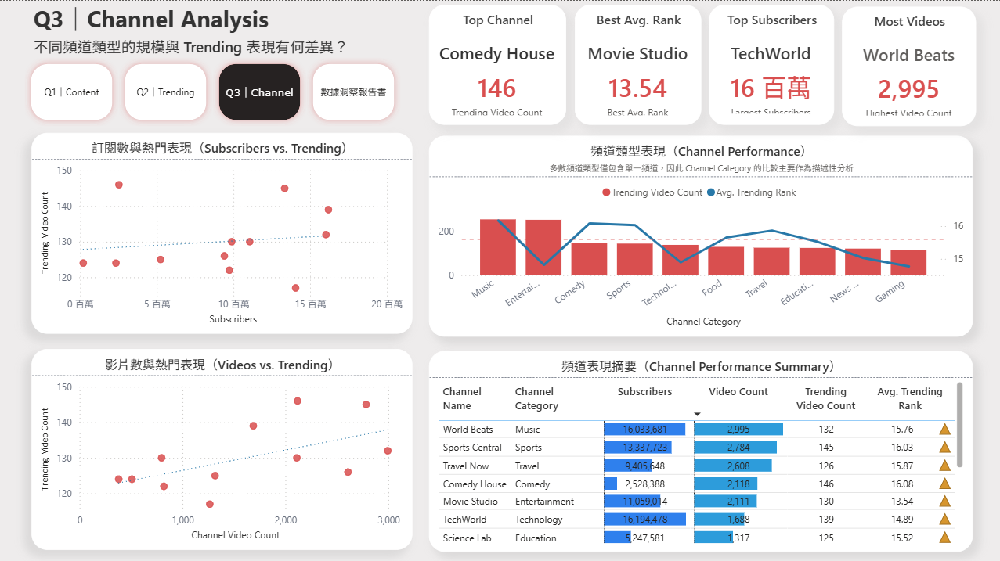
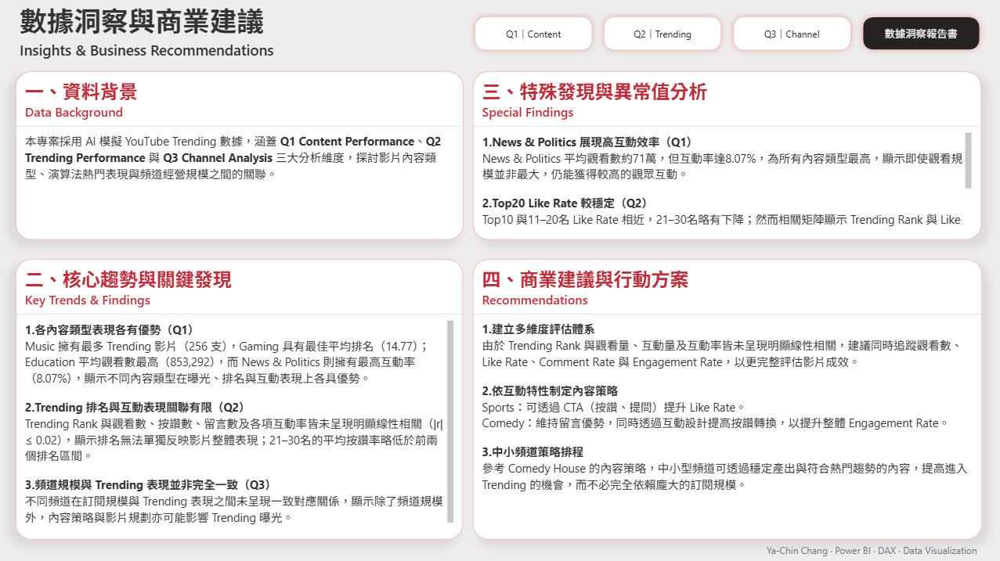

# YouTube Trending Analytics Dashboard
### YouTube 熱門內容與互動分析

以 AI 模擬的 YouTube Trending 資料為基礎，使用 Power BI 建立互動式分析儀表板，從 **Content Performance、Trending Performance 與 Channel Analysis** 三個面向，分析不同內容類型、Trending 排名、影片互動及頻道規模之間的關係，並將分析結果轉化為內容經營建議。

> **Note**
> 本專案使用 AI 生成之模擬資料，僅供資料分析學習與作品展示使用，不代表 YouTube 官方或實際平台數據。

---

## Project Objectives｜專案目標

本專案聚焦三項分析問題：

1. **Content Performance**  
   不同內容類型的熱門程度與表現有何差異？

2. **Trending Performance**  
   Trending 排名與影片觀看、互動表現之間有何關係？

3. **Channel Analysis**  
   不同頻道類型的規模與 Trending 表現有何差異？

---

## Dashboard Preview｜儀表板預覽

### Q1｜Content Performance Analysis

比較各內容類型的 **Trending Video Count、Avg. Trending Rank、Avg. Views、Like Rate、Comment Rate 與 Engagement Rate**，並透過觀看數 × 互動率矩陣觀察不同內容類型的表現定位。



**主要發現**
- Music 擁有最多 Trending 影片，共 **256 支**
- Gaming 平均 Trending Rank 最佳，為 **14.77**
- Education 平均觀看數最高，約 **853,292**
- News & Politics Engagement Rate 最高，達 **8.07%**

---

### Q2｜Trending Performance Analysis

將 Trending Rank 分為 **Top 10、11–20、21–30**，比較各排名區間的觀看數、Like Rate 與 Comment Rate，並利用相關性矩陣檢視排名、觀看量、互動量及互動率之間的線性關係。



**主要發現**
- Trending Rank 與 Views、Likes、Comments、Like Rate、Comment Rate、Engagement Rate 的相關係數皆接近 **0（|r| ≤ 0.02）**
- Top 10 與 11–20 名的 Like Rate 相近，21–30 名略為下降
- Like Rate 與 Engagement Rate 呈高度正相關（**r = 0.99**）
- 整體互動組成以按讚為主，Like Share 約 **89.33%**

因此，本資料中 **Trending Rank 無法單獨反映影片的觀看或互動表現**。

---

### Q3｜Channel Analysis

從 **Subscribers、Video Count、Trending Video Count 與 Avg. Trending Rank** 比較頻道規模、影片產出及 Trending 表現，觀察頻道規模是否與 Trending 曝光呈現一致關係。



**主要發現**
- Comedy House 擁有最多 Trending 影片，共 **146 支**
- Movie Studio 平均 Trending Rank 最佳，為 **13.54**
- TechWorld 訂閱人數最高，約 **1,619 萬**
- World Beats 影片總數最高，共 **2,995 支**
- 不同頻道的訂閱規模與 Trending 表現並未呈現一致對應關係
- Comedy House 訂閱人數約 **252 萬**，並非大型訂閱頻道，卻擁有最多 Trending 影片，顯示中小型頻道仍具有取得 Trending 曝光的機會

---

## Insights & Business Recommendations｜數據洞察與商業建議

整合 Q1–Q3 的分析結果，將主要趨勢、特殊發現與可執行的內容策略彙整為最終洞察頁。



### Key Insights

- **內容類型各有表現優勢**  
  Music 在 Trending 數量領先，Gaming 平均排名最佳，Education 平均觀看數最高，而 News & Politics 則具有最高 Engagement Rate。

- **Trending Rank 與互動表現關聯有限**  
  Trending Rank 與觀看數、按讚數、留言數及各項互動率皆未呈現明顯線性相關，因此排名不宜作為單一成效判斷依據。

- **頻道規模與 Trending 表現並非完全一致**  
  訂閱規模、影片產出與 Trending 表現之間未呈現一致對應關係，內容策略與影片規劃亦可能影響 Trending 曝光。

### Recommendations

1. **建立多維度評估體系**  
   同時追蹤 Views、Like Rate、Comment Rate 與 Engagement Rate，而非僅依 Trending Rank 評估影片成效。

2. **依互動特性制定內容策略**  
   Sports 可透過 CTA（按讚、提問）提升 Like Rate；Comedy 則可維持留言互動優勢，並進一步提高按讚轉換。

3. **中小型頻道採內容策略切入**  
   參考 Comedy House 的表現，中小型頻道可透過穩定產出與符合熱門趨勢的內容，提高進入 Trending 的機會，而不必完全依賴大型訂閱規模。

---

## Data Preparation｜資料處理

本專案於 Power Query 與 Power BI 中進行資料整理、品質檢核與分析欄位建置：

- 檢查 Views、Likes、Comments 等關鍵欄位的空值、數值合理性與邏輯一致性
- 建立 Logic Check 欄位進行資料品質檢核
- 移除 Country 維度，聚焦於內容、影片表現及頻道分析
- 整理 Category 與 Channel 對應資料
- 建立 Trending Rank 分群：Top 10、11–20、21–30
- 建立 Like Rate、Comment Rate、Engagement Rate 等衍生指標與分析 Measures
- 建立相關性矩陣所需的輔助資料表與 DAX 計算

---

## Data Model｜資料模型

以 `youtube_trending_videos` 為主表，透過 `Category_ID` 與 `Channel_ID` 分別與內容分類及頻道資料建立一對多關聯；其餘輔助資料表則用於相關性矩陣及排名分群分析。

主要資料表：

- `youtube_trending_videos`
- `youtube_categories`
- `youtube_channels`

---

## Dashboard Design｜視覺化設計

- 以 **YouTube Red** 為主要強調色，呼應分析主題並凸顯 KPI
- 使用 **KPI Cards** 呈現各分析面向的重要指標
- 使用 **矩形式樹狀圖** 比較各內容類型的 Trending 影片數量結構
- 使用 **折線圖** 比較不同內容類型的平均 Trending Rank
- 使用 **散佈圖** 分析觀看量、互動率與頻道規模之間的分布關係
- 使用 **相關性矩陣** 比較 Trending Rank 與影片表現指標之間的線性關係
- 使用 **條件式格式表格** 強化不同類別與頻道之間的數值比較
- 建立統一的頁面導覽與視覺層級，使 Q1–Q3 與最終洞察頁形成完整分析流程

---

## Interactive Web Dashboard｜互動網頁版

除 Power BI `.pbix` 原始檔外，本專案另將分析成果轉製為 HTML 互動式網頁，使使用者不需安裝 Power BI 即可於瀏覽器查看主要 KPI、圖表與分析結果。

**Live Demo：**  
[View Interactive Dashboard](https://weimichin.github.io/youtube-trending-analytics-dashboard/)

---

## Tools & Skills｜使用工具

- **Power BI** — Dashboard Design & Data Visualization
- **Power Query** — Data Cleaning & Transformation
- **DAX** — Measures, KPI & Correlation Analysis
- **HTML / CSS / JavaScript** — Interactive Web Dashboard
- **Chart.js** — Web Data Visualization
- **GitHub Pages** — Dashboard Deployment

---

## Repository Structure｜專案結構

```text
youtube-trending-analytics-dashboard/
│
├── README.md
│
├── powerbi/
│   └── YouTube_Trending_Dashboard.pbix
│
├── data/
│   ├── youtube_trending_videos.csv
│   ├── youtube_categories.csv
│   └── youtube_channels.csv
│
├── docs/
│   └── index.html
│
└── images/
    ├── dashboard_q1.png
    ├── dashboard_q2.png
    ├── dashboard_q3.png
    └── dashboard_insights.png
